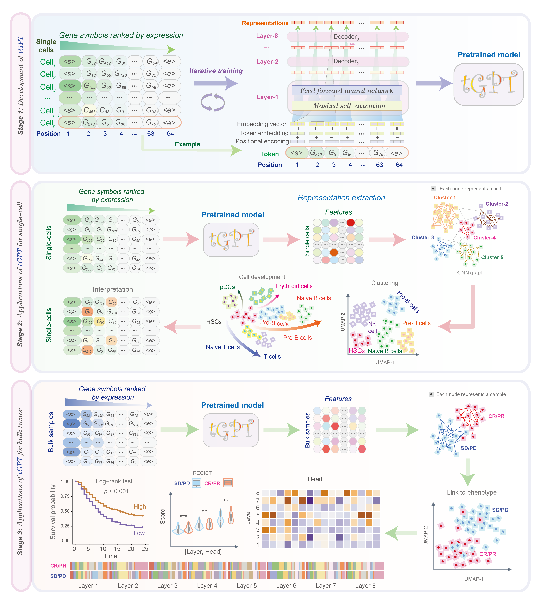
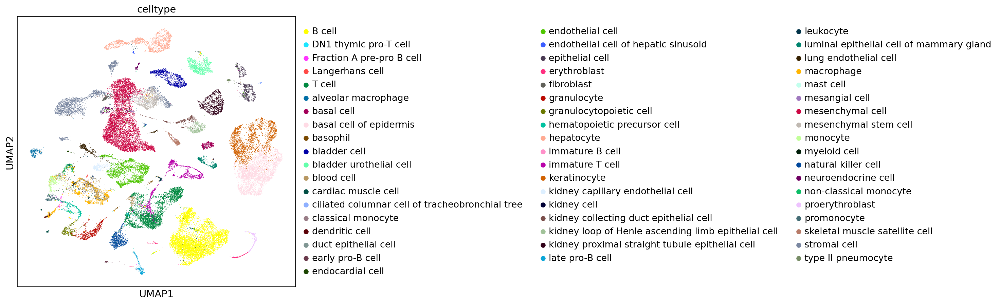
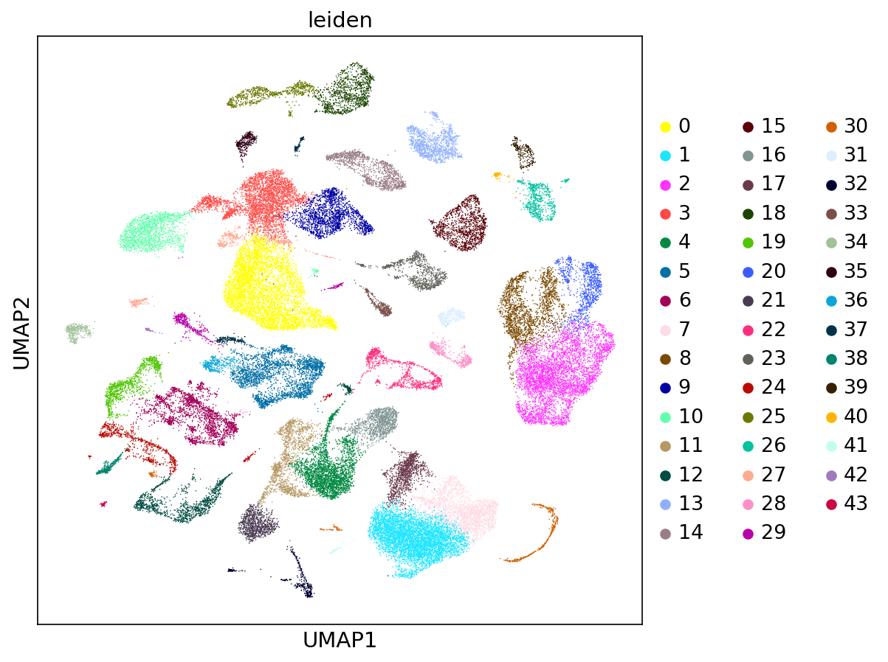

# tGPT:Generative pretraining from large-scale transcriptomes 

## tGPT

Code and models from the paper ["Generative pretraining from large-scale transcriptomes: Implications for single-cell deciphering and clinical translation"](https://www.biorxiv.org/content/10.1101/2022.01.31.478596v1.full).

## Introduction of tGPT

Exponential accumulation of single-cell transcriptomes poses great challenge for efficient assimilation. Here, we present an approach entitled tGPT towards integration of 22.3 million single-cell transcriptomes by modeling gene expression rankings as generative pretraining task tGPT is conceptually simple in that it autoregressively models the ranking of a gene in the context of its preceding neighbors. We demonstrated the high performance of tGPT on a range of fundamental single-cell analysis tasks and novel applications on bulk tissues. The single-cell clusters and cell lineage trajectories derived from tGPT are highly aligned with known cell labels and states. The feature patterns of tumor bulk tissues learned by tGPT are associated with a wide range of genomic alteration events, prognosis and treatment outcome of immunotherapy. tGPT represents a new analytical paradigm for integrating and deciphering massive amount of transcriptome data and it will facilitate the interpretation and clinical translation of single-cell transcriptomes

 

## Architecture of tGPT



This figure consists of three components: development of tGPT, applications of tGPT for single-cell and bulk tissue transcriptomes. 


## The following packages are required:

```
python==3.7.11 
numpy==1.20.0
torch==1.7.1
scanpy==1.9.1
```


## Using tGPT on own data

### Load packages


```python
import re
import os
import sys
import gzip
import torch
import numpy as np
import pandas as pd
import scanpy as sc
from tqdm import tqdm
from torch.utils.data import DataLoader, Dataset
from transformers import PreTrainedTokenizerFast, GPT2LMHeadModel, GPT2Model
```


### Setting parameter and file path


```python
device = "cuda" if torch.cuda.is_available() else "cpu" 
tokenizer_file = "lixiangchun/transcriptome-gpt-1024-8-16-64" 
checkpoint = "lixiangchun/transcriptome-gpt-1024-8-16-64" ## Pretrained model
celltype_path = "./data/Muris_cell_labels.txt.gz" ## Cell type annotation
max_len = 64 ## Number of top genes used for analysis
text_file = "./data/Muris_gene_rankings.txt.gz"  ## Gene symbols ranked by exprssion counts
```


### Extract features

```python
class LineDataset(Dataset):
    def __init__(self, lines):
        self.lines = lines
        self.regex = re.compile(r'\-|\.')
    def __getitem__(self, i):
        return self.regex.sub('_', self.lines[i])
    def __len__(self):
        return len(self.lines)

tokenizer = PreTrainedTokenizerFast.from_pretrained(tokenizer_file)
model = GPT2LMHeadModel.from_pretrained(checkpoint,output_hidden_states = True).transformer
model = model.to(device)
model.eval()

text_file = text_file
lines = [s.decode().strip() for s in gzip.open(text_file, "r").readlines()]

ds = LineDataset(lines)
dl = DataLoader(ds, batch_size=64)

Xs = []
for a in tqdm(dl, total=len(dl)):
    batch = tokenizer(a, max_length= max_len, truncation=True, padding=True, return_tensors="pt")

    for k, v in batch.items():
        batch[k] = v.to(device)

    with torch.no_grad():
        x = model(**batch)
        eos_idxs = batch.attention_mask.sum(dim=1) - 1
        hidden_layer = x.last_hidden_state
        xx = hidden_layer
        result_list = [[] for i in range(len(xx))]

        for j, item in enumerate(xx):
            result_list[j] = item[1:int(eos_idxs[j]),:].mean(dim =0).tolist()
        Xs.extend(result_list)
features = np.stack(Xs)
```

### Visualization

```python
adata=sc.AnnData(features)
celltype = pd.read_csv(celltype_path, header=None)[0].tolist()
adata.obs["celltype"] = celltype
adata.obs["celltype"] = adata.obs["celltype"].astype("category")

sc.pp.neighbors(adata,n_neighbors=20)
sc.tl.leiden(adata,resolution=0.6)
sc.tl.umap(adata)

#################  Cell Type  #######################
sc.pl.umap(adata, color = ["celltype"], show = True)

############ Single-cell Clustering  #############
sc.pl.umap(adata, color = ["leiden"], show = True)
```



